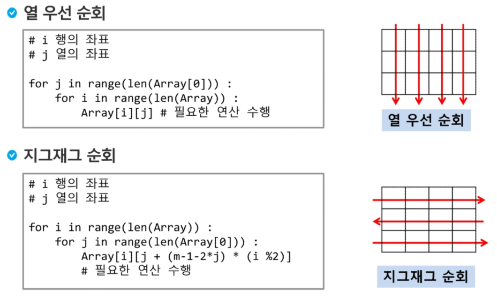
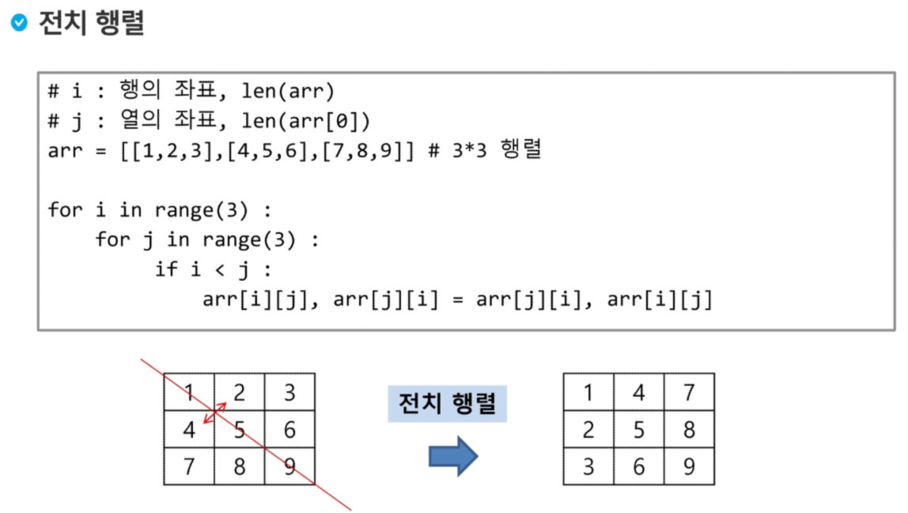

# Python 03/ Feb / 2020

> ### 알고리즘 집중 주간 첫시간

### Algorithm : 

1. 변수엔 하나의 데이터에 하나의 데이터만 저장할 수 있다.
2. 배열 순회:n X m 배열의 n*m개의 모든 원소를 빠짐없이 조사하는 방법.
3. 순회 - 하나도 빠짐없이 하나씩 돌면서 열어보는 것
4. 델타를 이용한 2차 배열 탐색: 2차 배열의 한 좌표에서 4방향의 인접 배열 요소를 탐색
5. 비트연산자를 쓰는이유? 실제 컴파일 할 때 굉장히 간단하게 처리할 수 있음

##### min-max 앞에서부터 다음항과 비교하는 방법으로 풀기

```python
def find(a, n):
    maxValue = a[0]
    minValue = a[0]
    for i in range(1, n):
        if a[i] > maxValue:
            maxValue = a[i]
        if a[i] < minValue:
            minValue = a[i]
	return maxValue - minValue

T = int(input())
for i in range (1, T+1):
    N = int(input())
    v = list(map(int, input().split(" ")))
    print("#%d"%i, find(v, N))
```

#####  전기버스

```python
#1)정류장을 인덱스로 충전기 위치를 표시한 경우
#2)정류장의 충전지 번호를 저장하고 맨앞과 끝에 0과 마지막을 저장해놓고 시작
#2번 풀이
def find(v, k, n, m):
    v.insert(0, 0) #출발점과 종점 번호 추가
    v.append(n)
    last = 0	#마지막 충전기
    cnt = 0		#충전 횟수
    for i in range(1, m+2):
        if(v[i]-v[i-1])>k: #충전기 사이가 k보다 멀때
            return 0
        if v[i]>last+k:    #i충전기까지 갈 수 없으면
            last = v[i-1]
            cnt = cnt + 1
    return cnt       	   #최소 충전횟수
```

#### 숫자카드

```python
def find():
    maxl = 0
    for i in range(N):
        num=int(v[i])
        card[num] = card[num]+1
        if card[maxl] < card[num]:
            maxl = num
        else:
            if card[maxl] == card[num]:
                maxl = max(maxl, num)
    return maxl
```

#### 구간합

```python

```


#### 배열 : 2차 배열이란?

##### 2차원 배열의 선언

```python
arr = [[0,1,2,3],[4,5,6,7]]
```



* i %2 가 0이면 짝수 / 1이면 홀수니까

짝수일땐 뒤쪽이 없어져서 array[i] [j] 가 되고 홀수일땐 1이 곱해져서 [j+(m-1-2*j)]씩 된다고 보면 됨.


#### 델타를 이용한 2차 배열 탐색

2차 배열의 한 좌표에서 4방향의 인접 배열 요소를 탐색

```python
di=[-1,0,1,0]
dj=[0,1,0,-1]
T=int(input())         #시행 횟수
for tc in range(1, T+1):
    N=int(input())     #행의 갯수
    arr=[list(map(int, input().split())) for i in range(N)]
    res=0              #절대값 합 받을 결과 변수
    tmp=[[0]*N for i in range(N)]
    for i in range(N):
        for j in range(N):
            k=arr[i][j]
            SUM=0
            for x in range(4):
                dx = i +di[x]
                dy = j +dj[x]
                if 0<=dx<N and 0<=dy<N:
                    SUM+=abs(k-arr[dx][dy])
            tmp[i][j]=SUM
    for i in range(4):
        for j in range(4):
            res += tmp[i][j]
    print("#{} {}".format(tc, res))
```




